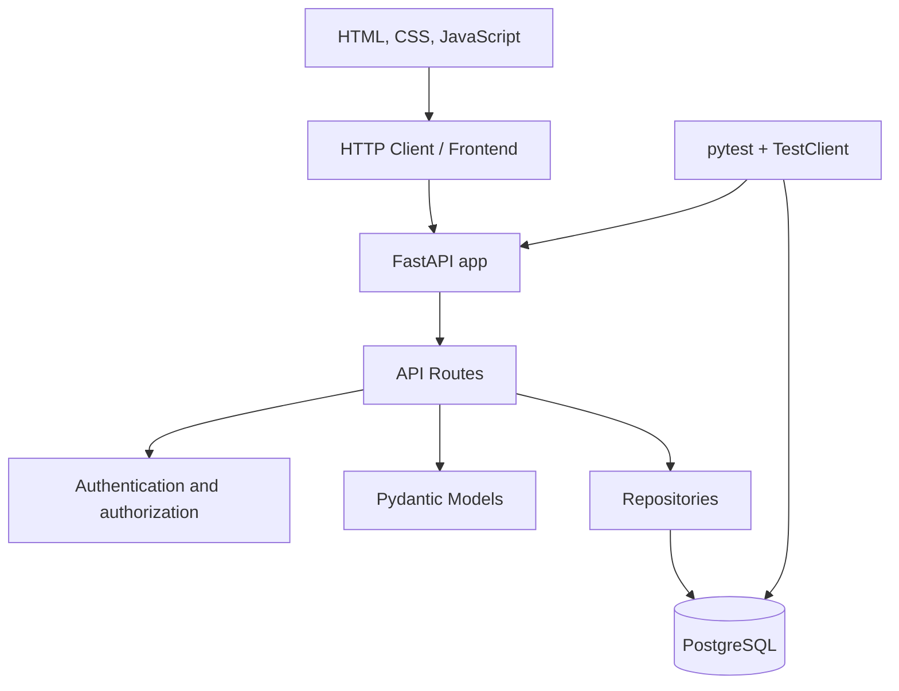
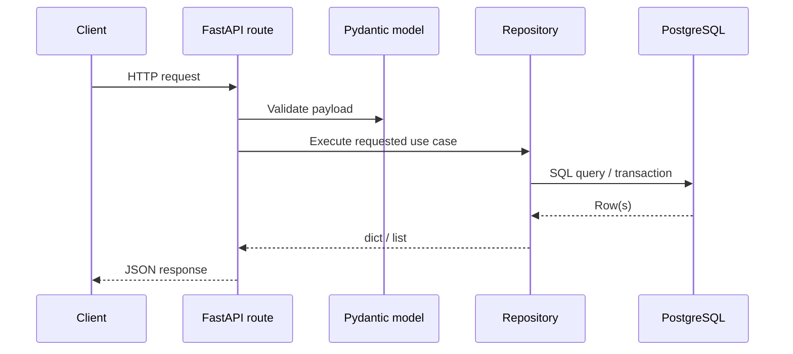
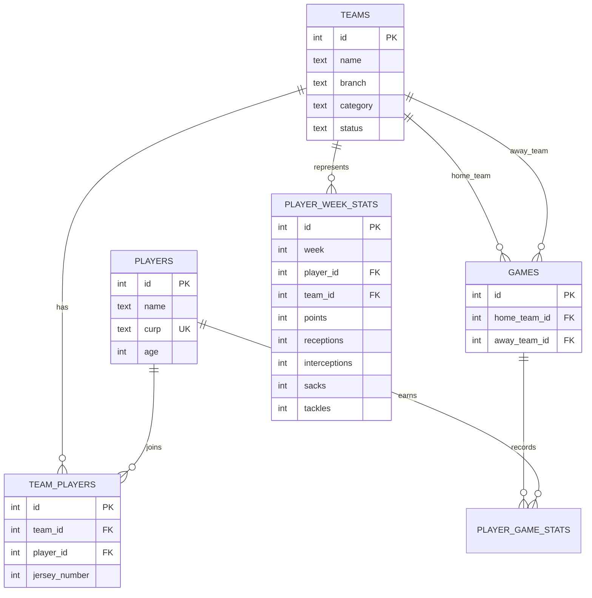
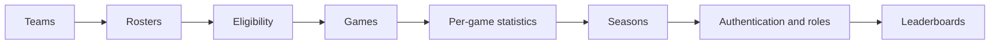

# Flagtastic Architecture

Flagtastic is a platform for managing a flag football league. The current application focuses on registering teams, managing rosters, validating basic eligibility rules, and creating games between teams.

The project follows a deliberately lightweight layered architecture. The current priority is to keep the domain clear, preserve data integrity, and allow the system to grow without introducing premature abstractions.

## Architectural Goals

- Keep the HTTP API simple and predictable.
- Separate input contracts from persistence logic.
- Model players as reusable people across multiple teams.
- Protect critical integrity rules at the database level.
- Keep league rules visible and covered by tests.
- Make it easy to evolve toward seasons, statistics, and leaderboards.

## Overview



The application starts in `main.py`, creates the FastAPI instance, mounts static assets, and registers the application routers. Database schema changes are managed separately through versioned Alembic migrations.

## Layers

### Application

Main file: `main.py`

Responsibilities:

- Create the FastAPI instance.
- Register routers.
- Expose the `GET /live` health check.

### Contracts

Main file: `models.py`

Responsibilities:

- Define Pydantic models that validate incoming payloads.
- Keep basic shape and range validation close to the API boundary.

Current models:

- `TeamCreate`: name, branch, and category.
- `PlayerCreate`: name, CURP, age, and jersey number.
- `GameCreate`: home team and away team.
- `UserCreate`: email, name, password, and role.
- `LoginRequest`: normalized email and secret password input.

### HTTP Routes

Main folder: `routes/`

Responsibilities:

- Define public API endpoints.
- Translate domain or persistence errors into HTTP responses.
- Validate request flow rules that depend on existing resources.
- Delegate data operations to repositories.

Current routers:

- `routes/auth.py`: login, current-session identity, and logout.
- `routes/teams.py`: team registration and listing.
- `routes/players.py`: player registration and roster listing by team.
- `routes/games.py`: game creation and listing.
- `routes/statistics.py`: Excel imports, game statistics, player totals, and leaderboards.

### Dependencies

Main folder: `dependencies/`

Responsibilities:

- Resolve the authenticated user from the `HttpOnly` session cookie.
- Enforce league-administrator permissions for league-wide writes.
- Restrict roster changes to administrators or assigned team representatives.
- Return consistent `401` and `403` responses without relying on frontend visibility.

### Repositories

Main folder: `repositories/`

Responsibilities:

- Open PostgreSQL connections.
- Execute SQL queries.
- Control transactions with `commit` and `rollback`.
- Convert database results into dictionaries.
- Encapsulate queries by entity or aggregate.

Current repositories:

- `repositories/teams.py`
- `repositories/players.py`
- `repositories/games.py`
- `repositories/users.py`
- `repositories/statistics.py`

### Services

Main folder: `services/`

Responsibilities:

- Coordinate business rules that span repositories.
- Keep authentication decisions separate from password persistence.
- Return public data without exposing credential hashes.

Current services:

- `services/auth.py`: credential authentication and account-status checks.
- `services/statistics_import.py`: structured workbook parsing and row validation.

### Database

Main file: `database.py`

Responsibilities:

- Resolve `DATABASE_URL`.
- Create psycopg connections using `dict_row`.
- Manage schema evolution through versioned Alembic migrations in `migrations/`.

Current engine:

- PostgreSQL
- Python client: `psycopg`

## Request Flow



Example for registering a player:

1. The client calls `POST /api/teams/{team_id}/players`.
2. FastAPI validates the body with `PlayerCreate`.
3. The route verifies that the team exists.
4. The repository finds or creates the player identity by CURP.
5. The repository validates whether the player is already registered in the same branch and category.
6. The repository creates the membership in `team_players`.
7. The route returns `201 Created` or translates conflicts into `409 Conflict`.

## Data Model



### Modeling Decisions

A person's identity is separated from their participation in teams.

- `players` represents the person.
- `teams` represents a team registered in a branch and category.
- `team_players` represents a person's membership in a team.
- `games` represents a matchup between two teams.
- `player_week_stats` stores one official row per jornada, player, and team.

This separation allows the same person to play for multiple teams when league eligibility rules allow it.

## Domain Rules

### Teams

- Every team has `name`, `branch`, `category`, and `status`.
- New teams are created with `status = "pending"`.

### Players

- CURP uniquely identifies a person.
- The public roster does not expose CURP.
- Public roster identity includes the optional AKA and profile-photo URL.
- A player may participate in teams from different branches.
- A player may participate in teams from different categories.
- A player may not participate in two teams within the same branch and category combination.
- A player may not be registered twice in the same team.
- Jersey numbers must be unique within each team.
- The same jersey number may be reused across different teams.

### Games

- A game has a home team and an away team.
- Both teams must exist.
- A team cannot play against itself.
- Official workbook imports pair consecutive 15-row team blocks within the same division.
- Imported scores are inferred from touchdowns and conversions; incomplete tied reconstructions use defensive events as a deterministic one-point tiebreak.

## Data Integrity

The database protects structural constraints:

```text
players.curp UNIQUE
team_players(team_id, player_id) UNIQUE
team_players(team_id, jersey_number) UNIQUE
```

Foreign keys use `ON DELETE CASCADE` to delete related memberships or games when a team or player is deleted.

Rules that need league context, such as preventing a player from registering twice in the same branch and category, are currently validated in the repository layer.

## Current Endpoints

| Method | Path | Description |
|---|---|---|
| `GET` | `/live` | Application health check |
| `POST` | `/api/auth/login` | Authenticates credentials and creates a session cookie |
| `GET` | `/api/auth/me` | Returns the user associated with an active session |
| `POST` | `/api/auth/logout` | Revokes the current session and removes its cookie |
| `POST` | `/api/teams` | Creates a team |
| `GET` | `/api/teams` | Lists teams |
| `DELETE` | `/api/teams/{team_id}` | Deletes a team and dependent records; league administrators only |
| `POST` | `/api/teams/{team_id}/players` | Registers a player in a team |
| `GET` | `/api/teams/{team_id}/players` | Lists a team's roster |
| `POST` | `/api/games` | Creates a game |
| `GET` | `/api/games` | Lists games |
| `PATCH` | `/api/games/{game_id}/score` | Updates a game's score |
| `GET` | `/api/standings` | Lists standings by branch and category |
| `POST` | `/api/weeks/{week}/player-stats/import` | Atomically replaces a complete jornada from `.xlsx` |
| `POST` | `/api/statistics/import` | Atomically imports all official `Wk` sheets, statistics, games, and inferred scores |
| `GET` | `/api/weeks/{week}/player-stats` | Lists a jornada's individual statistics |
| `GET` | `/api/players/{player_id}/stats` | Returns a player's derived totals |
| `GET` | `/api/statistics/leaderboards` | Returns five leaders per metric and division |

The weekly spreadsheet uses `rama`, `categoria`, `equipo`, and `numero` to resolve a roster membership. Player names shown publicly always come from `players.name`, never from imported text. Only the 50 source-event columns are read; formula-helper columns are deliberately excluded to prevent double counting. Completed passes count as both a completion and an attempt, while `Intentos Pase` supplies incomplete attempts.

The games client keeps one API snapshot and filters it locally by `week` and by
the branch/category exposed in each nested team summary. Development standings
can be exercised with `scripts.balance_mock_games`: it fills only per-division
game-count deficits, produces no tied scores, and is safe to rerun once balanced.

## Current Web Pages

| Method | Path | Description |
|---|---|---|
| `GET` | `/` | Redirects to `/teams` |
| `GET` | `/teams` | Filterable team directory |
| `GET` | `/teams/{team_id}/roster` | Dedicated team roster and authorized roster management |
| `GET` | `/games` | Games and scores page |
| `GET` | `/standings` | Standings page |
| `GET` | `/statistics` | Public individual leaderboards |
| `GET` | `/login` | Operational user login |

## Frontend

The frontend foundation lives in:

- `templates/base.html`
- `templates/teams.html`
- `templates/roster.html`
- `templates/games.html`
- `templates/standings.html`
- `templates/statistics.html`
- `templates/login.html`
- `static/style.css`
- `static/layout.js`
- `static/api.js`
- `static/teams.js`
- `static/roster.js`
- `static/games.js`
- `static/standings.js`
- `static/statistics.js`
- `static/login.js`
- `static/register.js`
- `static/dashboard.js`

It is currently a lightweight server-rendered HTML, CSS, and JavaScript layer. Shared layout concerns live in `base.html` and `layout.js`. Page-specific behavior lives in the JavaScript file for that page. The teams page is only a directory: selecting a team navigates to its dedicated roster route, keeping directory filtering and roster management as separate responsibilities. The backend remains API-first, so the frontend can evolve without coupling directly to persistence.

## Testing

The test suite uses `pytest` and `fastapi.testclient.TestClient`.

Current coverage:

- Team registration and listing.
- Player registration and roster listing by team.
- Nonexistent team handling when registering players.
- Duplicate jersey protection within the same team.
- CURP reuse as a single identity with multiple valid memberships.
- Duplicate player restriction within the same branch and category.
- Game creation and listing.
- Protection against a team playing against itself.
- Game creation handling for nonexistent teams.
- Player self-registration and session-backed personal dashboards.
- Self-service team membership with one team per division.
- Excel passing-stat validation and week-dependent qualification rules.

Tests clean the database between cases to preserve isolation.

## Configuration and Deployment

The application reads the connection string from `DATABASE_URL`. The value is required: the application and Alembic fail explicitly when it is not configured. Local values are documented in `.env.example`; CI and deployed environments provide the value through environment configuration or secrets.

Schema changes are applied before application startup:

```text
python -m alembic upgrade head
```

The `Dockerfile` builds an image based on `python:3.14-slim`, installs dependencies from `requirements.txt`, copies the project, and starts Uvicorn on `0.0.0.0:8000`.

While profile media uses local filesystem storage, deployed containers must
mount persistent storage at `PROFILE_PHOTO_DIR`. The image excludes local
uploads and development dependency directories from its build context. A
container replacement must therefore reuse the same media volume.

Application command:

```text
uvicorn main:app --host 0.0.0.0 --port 8000
```

## Delivery Architecture

GitHub Actions runs the delivery checks on every push and pull request.

The current pipeline validates:

- Alembic migrations against a clean PostgreSQL service before running tests.
- The Python test suite.
- PostgreSQL integration through a service container.
- Docker image builds.
- Deterministic image tags for future promoted deployments.

Container images should be tagged with immutable references, such as a short commit SHA, and release references, such as Git version tags. Branch tags may be useful for development visibility, but deployments should prefer immutable tags.

Avoid using `latest` as a deployment contract.

## Expected Evolution

The current architecture can grow incrementally:



The service layer currently owns authentication decisions. As domain rules grow, it can also centralize eligibility rules, scheduling, statistics capture, standings calculations, and administrative permissions.

## Current Conventions

- Routes handle HTTP responses and client-visible errors.
- Repositories are responsible for SQL and transactions.
- Pydantic models validate incoming payloads.
- The database keeps constraints that should not depend only on application code.
- Public responses avoid exposing CURP in rosters.

## Risks and Considerations

- Production deployments must run `alembic upgrade head` as a controlled release step before starting the new application version.
- Domain rules are partially split between routes and repositories; if they grow, extracting services would help.
- Credential authentication, database-backed sessions, and role-based write authorization are implemented.
- Session cookies are `HttpOnly`, `SameSite=Lax`, and `Secure` by default; local non-HTTPS environments must explicitly disable the secure flag.
- CURP privacy must remain explicit as administrative and public endpoints are added.
- Statistics imports replace one game's snapshot in a single transaction, so invalid workbooks cannot partially alter public totals.

## Player Accounts And Dashboard

`users.player_id` links one login to one global player identity. A player may
claim an existing roster identity only when normalized name, CURP, and age
match; a player identity can be linked to only one login. The personal
dashboard is resolved from the authenticated session and never accepts a
player identifier from the browser.

Representatives may create teams. The creator is inserted into
`team_representatives` in the same transaction, giving that user management
rights only over the new team. Players join rosters directly in V1 while the
existing one-team-per-division and unique-jersey constraints remain active.

## Passing Leaderboard

Passing rows store completed and attempted passes. Completion percentage is
derived from aggregate totals and is never persisted separately. Through
jornada 3, every player with at least one attempt qualifies. Beginning with
jornada 4, a player needs at least 30 cumulative attempts in the division.
The ranking sorts by percentage, then attempts, then player name.

The official V1 leaderboard catalog is: completion percentage, receptions,
points, tackles, interceptions, and sacks.

Administrators import the per-game source rows from `/statistics`. The page
provides the canonical `.xlsx` template and a game selector; a successful
import replaces that game's complete statistics snapshot atomically.

## Role Administration

The first trusted `league_admin` is created from a local terminal. Subsequent
roles are granted through `/admin/users`; both listing users and changing a
role are protected by the backend administrator dependency. Responses never
include password hashes or CURP, and administrators cannot demote themselves.

## Player Profile Media

`players.aka` stores an optional public nickname and
`players.profile_photo_path` stores only a generated filename. New player
accounts must submit a raster JPG, PNG, or WebP file no larger than 5 MB. The
server validates its binary signature, never trusts the client filename, and
serves accepted files from `/media/profiles`. Local media lives outside source
control under the configurable `PROFILE_PHOTO_DIR`; production deployment can
replace this persistence boundary with object storage without changing player
or authentication records. The same public identity presentation is reused in
the personal dashboard, dedicated team rosters, and individual-statistics
leaderboards. AKA is preferred for display, the legal roster name remains
visible as supporting identity, and players without media receive an initials
placeholder rather than a broken image.
